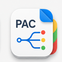
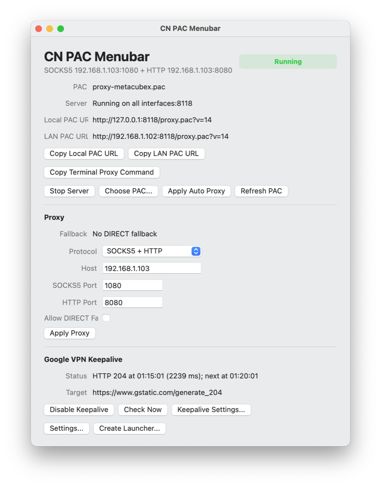
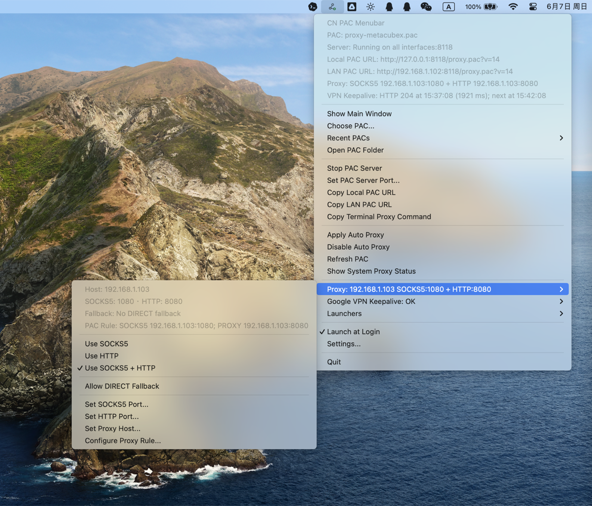

<div align="center">
  
  <h1>CN PAC Menubar</h1>
  <p><strong>Serve PAC files from the menu bar, apply macOS automatic proxy configuration, and share proxy access with apps and LAN devices.</strong></p>
  <p>
    <a href="https://github.com/YTwsy/cn-pac-menubar/releases/latest"></a>
    
    
    
  </p>
  <p>
    <a href="README.md">中文</a> · <strong>English</strong>
  </p>
  <p>
    <a href="https://github.com/YTwsy/cn-pac-menubar/releases/latest">Download</a> ·
    <a href="#build">Build</a> ·
    <a href="docs/RELEASE.md">Release Process</a> ·
    <a href="#lan-devices">LAN Devices</a> ·
    <a href="#google-vpn-keepalive">Google VPN Keepalive</a>
  </p>
  <p>
    
    
  </p>
</div>

## Features

- Serve a selected PAC file from a local menu-bar app.
- Rewrite proxy directives to the configured SOCKS5/HTTP endpoints.
- Apply macOS automatic proxy settings without changing the rest of the network stack manually.
- Copy a LAN PAC URL for phones, tablets, and other computers on the same network.
- Generate per-app proxy launchers for apps that honor environment variables or Chromium/Java proxy flags.
- Run a strict Google VPN keepalive probe through the PAC-resolved proxy path.

## Build

```sh
swift test
swift build -c release
Scripts/package-app.sh
```

The packaged app is written to `.build/CNPacMenubar.app`.

`Scripts/package-app.sh` first tries SwiftPM. If the local Command Line Tools installation cannot satisfy SwiftPM's macOS platform lookup, the script falls back to a direct `swiftc` build with the installed macOS SDK.

The bundle version comes from `VERSION` by default. Release builds can override it:

```sh
APP_VERSION=1.0 APP_BUILD_NUMBER=1 Scripts/package-app.sh
```

## Install Locally

```sh
Scripts/package-app.sh
cp -R .build/CNPacMenubar.app ~/Applications/
```

## Runtime Data

Settings are stored in:

```text
~/Library/Application Support/cn-pac-menubar/settings.json
~/Library/Application Support/cn-pac-menubar/launchers.json
```

Generated proxy launchers read `settings.json` every time they start, so updating the HTTP proxy host or port in CN PAC Menubar changes future launcher sessions without rebuilding the launcher.

## PAC Proxy Fallback

Proxy rules fail closed by default: generated PAC proxy chains omit a final `DIRECT`, so a host that should use the proxy will fail if all configured proxies are unavailable instead of silently connecting directly.

Use **Proxy > Allow DIRECT Fallback** if you explicitly want the old behavior where PAC clients try `DIRECT` after the SOCKS5/HTTP proxy endpoints fail. Built-in direct rules for private IPs and direct-domain matches still return `DIRECT` either way.

## Google VPN Keepalive

The menu includes **Google VPN Keepalive** for sending a strict scheduled PAC proxy probe while the app is running. It evaluates the selected PAC for the target URL, uses the first proxy directive explicitly, and treats `DIRECT` as a failed keepalive path. Enable it from the menu or main window, then use **Keepalive Settings...** to adjust:

- Target URL, defaulting to `https://www.gstatic.com/generate_204`.
- Interval in seconds, from 30 seconds to 24 hours.
- Timeout in seconds, from 1 to 120 seconds.

The menu and main window show the latest result and the next scheduled request.

## LAN Devices

The app keeps the Mac's own automatic proxy URL on loopback, for example `http://127.0.0.1:8118/proxy.pac`, and also exposes a LAN PAC URL in the menu bar such as `http://192.168.1.103:8118/proxy.pac`. Use **Copy LAN PAC URL** for phones, tablets, or other computers on the same network.

For another device to use the PAC successfully, macOS may need to allow incoming connections for CN PAC Menubar, and the proxy endpoint written inside the PAC must be reachable from that device. If the proxy runs on this Mac, set **Proxy Host** to this Mac's LAN IP and make sure the upstream proxy app allows LAN connections.

## Launcher Compatibility

Launchers now choose a profile for the target app:

- Environment: exports common proxy variables such as `HTTP_PROXY`, `HTTPS_PROXY`, `ALL_PROXY`, `FTP_PROXY`, `grpc_proxy`, and `NO_PROXY`.
- Chromium/Electron: adds Chromium proxy flags like `--proxy-server` and `--proxy-bypass-list` in addition to proxy variables.
- Java: adds `JAVA_TOOL_OPTIONS` JVM proxy properties in addition to proxy variables.
- System PAC preferred: marks Apple/system apps that may ignore launcher variables and are better handled by macOS automatic proxy configuration.

## Release

Releases are driven by version tags:

```sh
VERSION="$(cat VERSION)"
git tag "v${VERSION}"
git push origin main
git push origin "v${VERSION}"
```

The `Release` GitHub Actions workflow builds the app, creates `CNPacMenubar-vVERSION-macos.zip`, and publishes a GitHub Release for the tag. See [docs/RELEASE.md](docs/RELEASE.md) for the full process.
